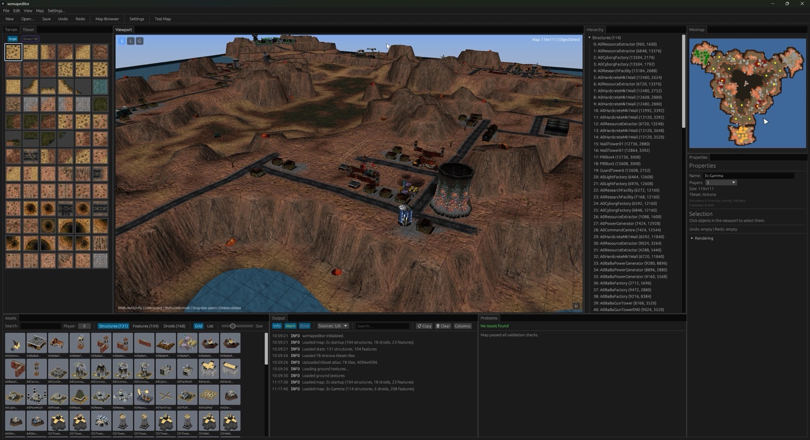

<p align="center">
  
</p>

<h1 align="center">wzmapeditor</h1>

<p align="center">A cross-platform map editor for <a href="https://wz2100.net/">Warzone 2100</a>, built in Rust with <a href="https://github.com/emilk/egui">egui</a> and <a href="https://github.com/gfx-rs/wgpu">wgpu</a>.</p>



---

## Try it online

A browser build runs at **[mapeditor.wz2100.net](https://mapeditor.wz2100.net)**.

---

## Documentation

The user manual ships inside the editor: press `F1` for a topic covering whatever
you are currently doing, click the `?` on any panel, or open `Help > Help Topics…`
to browse and search everything.

The same topics are readable here — start with
**[Getting Started](crates/wzmapeditor/help/getting-started.md)** and
**[Interface Overview](crates/wzmapeditor/help/interface-overview.md)**, or browse
the [full set](crates/wzmapeditor/help/):

- **Maps** — [creating & opening](crates/wzmapeditor/help/maps-create.md), [resizing](crates/wzmapeditor/help/maps-resize.md), [properties](crates/wzmapeditor/help/maps-properties.md), [publishing](crates/wzmapeditor/help/maps-publish.md)
- **Terrain** — [tool overview](crates/wzmapeditor/help/terrain.md), [height brush](crates/wzmapeditor/help/terrain-height-brush.md), [vertex sculpt](crates/wzmapeditor/help/terrain-vertex-sculpt.md), [texture painting](crates/wzmapeditor/help/terrain-texture-paint.md), [ground types](crates/wzmapeditor/help/terrain-ground-types.md), [stamp](crates/wzmapeditor/help/terrain-stamp.md), [walls](crates/wzmapeditor/help/terrain-walls.md), [mirroring](crates/wzmapeditor/help/terrain-mirror.md)
- **Objects & generation** — [placing objects](crates/wzmapeditor/help/objects.md), [map generator](crates/wzmapeditor/help/generator.md)
- **View & analysis** — [rendering & overlays](crates/wzmapeditor/help/rendering.md), [minimap](crates/wzmapeditor/help/minimap.md), [validation](crates/wzmapeditor/help/validation.md), [balance](crates/wzmapeditor/help/balance.md)
- **Reference** — [mouse & gestures](crates/wzmapeditor/help/mouse-gestures.md), [graphics & theme](crates/wzmapeditor/help/settings-graphics.md), [testing your map](crates/wzmapeditor/help/test-map.md)

Topics cross-link each other, so you can follow them from any starting point.

---

## Requirements

- A [Warzone 2100](https://wz2100.net/) 4.x installation

For building from source:

- [rustup](https://rustup.rs/) (installs `rustc` + `cargo`, stable 1.97+)

---

## Install

Prebuilt binaries are available for Windows (x64), macOS (Apple Silicon), and Linux (x64). Download the archive for your platform from the [Releases](../../releases) page, unzip, and run the executable.

---

## Configuration

Configuration and cached game data live in:

- Windows: `%APPDATA%\wzmapeditor\`
- Linux/macOS: `~/.config/wzmapeditor/`

---

## Building from source

Requires [Rust](https://rustup.rs/) 1.97 or later (stable toolchain).

```bash
git clone https://github.com/Warzone2100/wzmapeditor
cd wzmapeditor
cargo build --release
```

The latest `main` is deployed at [dev.mapeditor.wz2100.net](https://dev.mapeditor.wz2100.net).

For a debug build with logging:

```bash
RUST_LOG=info cargo run
```

## Running Tests

```bash
cargo test --workspace
```

## Linting

```bash
cargo fmt --check          # Check formatting
cargo clippy --workspace   # Run clippy lints (pedantic + cargo enabled)
```

---

## Related Projects

- [Warzone 2100](https://github.com/Warzone2100/warzone2100)
- [FlaME](https://github.com/Warzone2100/FlaME)
- [wzmaplib](https://github.com/Warzone2100/warzone2100/tree/master/lib/wzmaplib)
- [Maps Database](https://github.com/Warzone2100/maps-database)

---

## Licensing

wzmapeditor is free software; you can redistribute it and/or modify it under the terms of the GNU General Public License as published by the Free Software Foundation; either version 2 of the License, or (at your option) any later version.

[](LICENSE)
